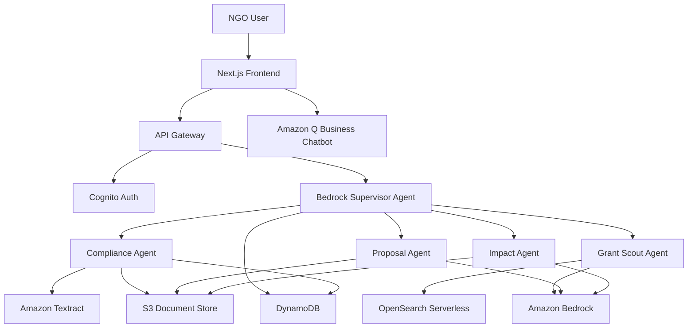

# Design Document: NidhiAI Platform

## Overview

NidhiAI is a serverless, event-driven B2B SaaS platform that helps Indian NGOs access CSR funding through automated compliance checking, intelligent grant discovery, and AI-powered proposal generation. The platform leverages AWS Bedrock's Multi-Agent System architecture with a Supervisor Pattern to orchestrate four specialized agents.

### Key Design Principles

1. **Serverless-First**: Use AWS Lambda for all compute to achieve automatic scaling and cost efficiency
2. **Event-Driven Architecture**: Decouple components using asynchronous messaging for resilience
3. **Agent Specialization**: Each agent has a single, well-defined responsibility
4. **Security by Default**: Encrypt all data at rest and in transit, implement least-privilege access
5. **Performance Optimization**: Cache frequently accessed data, use parallel processing where possible

### Technology Stack

- **Frontend**: Next.js 14 with React Server Components
- **Backend**: AWS Lambda (Python 3.12 runtime)
- **LLM**: Amazon Bedrock with Claude models
- **Document Processing**: Amazon Textract
- **Vector Database**: Amazon OpenSearch Serverless
- **Object Storage**: Amazon S3
- **Database**: Amazon DynamoDB
- **Authentication**: AWS Cognito
- **API Gateway**: AWS API Gateway (REST API)
- **Orchestration**: Amazon Bedrock Agents (Supervisor Pattern)
- **Chatbot**: Amazon Q Business
- **Monitoring**: Amazon CloudWatch

## Architecture

### High-Level Architecture



### Agent Architecture (Supervisor Pattern)

The Supervisor Agent is implemented using Amazon Bedrock Agents with the Supervisor Pattern, which orchestrates specialized agents:

1. **Request Analysis**: Supervisor Agent analyzes the user request and determines which specialized agents are needed
2. **Execution Planning**: Creates an execution plan with agent dependencies
3. **Agent Invocation**: Invokes specialized agents through Bedrock's multi-agent orchestration
4. **Data Flow**: Passes outputs from upstream agents to downstream agents via Bedrock's context management
5. **Error Handling**: Handles agent failures with retry logic and graceful degradation
6. **Response Aggregation**: Combines agent outputs into a unified response

**Implementation Details**:
- Each specialized agent is configured as a Bedrock Agent with specific action groups
- The Supervisor Agent uses Bedrock's built-in orchestration capabilities
- Agent-to-agent communication is handled through Bedrock's session state
- Lambda functions serve as action groups for each agent's specific tasks

### Data Flow Examples

**Compliance Check Flow**:
```
User uploads document → S3 → Compliance Agent → Textract → Extract dates → 
Validate → Store result → Notify user
```

**Grant Discovery Flow**:
```
User queries "Education grants" → Grant Scout Agent → Generate embedding → 
OpenSearch semantic search → Rank results → Return top 5
```

**Proposal Generation Flow**:
```
User selects grant → Proposal Agent → Fetch NGO profile → Fetch grant details → 
Generate proposal (Bedrock) → Format PDF → Store in S3 → Return download link
```

## Components and Interfaces

### 1. Authentication Service

**Responsibility**: Manage user registration, login, and session management

**Technology**: AWS Cognito User Pool

**Interface**:
```typescript
interface AuthService {
  signUp(email: string, password: string): Promise<UserId>
  signIn(email: string, password: string): Promise<AuthToken>
  signOut(token: AuthToken): Promise<void>
  verifyToken(token: AuthToken): Promise<UserId>
  resetPassword(email: string): Promise<void>
}
```

**Implementation Notes**:
- Use Cognito hosted UI for OAuth flows
- Configure password policy: minimum 8 characters, require uppercase, lowercase, number
- Enable MFA as optional for enhanced security
- Set token expiration to 1 hour with refresh token valid for 30 days

### 2. NGO Profile Service

**Responsibility**: Store and retrieve NGO profile information

**Technology**: Amazon DynamoDB

**Data Model**:
```typescript
interface NGOProfile {
  ngoId: string              // Primary key (UUID)
  userId: string             // Foreign key to Cognito user
  ngoName: string
  panCard: string            // Format: AAAAA9999A
  sector: string             // e.g., "Education", "Healthcare"
  registrationDate: string   // ISO 8601
  contactEmail: string
  contactPhone: string
  address: Address
  complianceStatus: ComplianceStatus
  createdAt: string
  updatedAt: string
}

interface Address {
  street: string
  city: string
  state: string
  pincode: string
}

interface ComplianceStatus {
  certificate12A: CertificateStatus
  certificate80G: CertificateStatus
  certificateCSR1: CertificateStatus
}

interface CertificateStatus {
  uploaded: boolean
  validUntil: string | null
  status: "valid" | "expired" | "pending" | "not_uploaded"
  s3Key: string | null
}
```

**Interface**:
```typescript
interface ProfileService {
  createProfile(userId: string, profile: NGOProfileInput): Promise<NGOProfile>
  getProfile(ngoId: string): Promise<NGOProfile>
  updateProfile(ngoId: string, updates: Partial<NGOProfile>): Promise<NGOProfile>
  validatePanCard(panCard: string): boolean
}
```

**PAN Card Validation**:
- Regex: `^[A-Z]{5}[0-9]{4}[A-Z]{1}$`
- First 3 characters must be valid PAN prefix
- 4th character must be 'P' for individual or 'C' for company

### 3. Document Management Service

**Responsibility**: Handle document uploads, storage, and retrieval

**Technology**: Amazon S3 with server-side encryption (SSE-S3)

**S3 Bucket Structure**:
```
nidhiai-documents/
  {ngoId}/
    compliance/
      12A_{timestamp}.pdf
      80G_{timestamp}.pdf
      CSR1_{timestamp}.pdf
    proposals/
      {grantId}_{timestamp}.pdf
    reports/
      impact_{timestamp}.pdf
```

**Interface**:
```typescript
interface DocumentService {
  uploadDocument(
    ngoId: string,
    documentType: DocumentType,
    file: Buffer,
    metadata: DocumentMetadata
  ): Promise<DocumentReference>
  
  getDocument(documentRef: DocumentReference): Promise<SignedUrl>
  
  deleteDocument(documentRef: DocumentReference): Promise<void>
  
  listDocuments(ngoId: string, documentType: DocumentType): Promise<DocumentReference[]>
}

type DocumentType = "12A" | "80G" | "CSR1" | "proposal" | "impact_report"

interface DocumentMetadata {
  fileName: string
  fileSize: number
  mimeType: string
  uploadedAt: string
}

interface DocumentReference {
  s3Key: string
  s3Bucket: string
  documentType: DocumentType
  ngoId: string
}
```

**Security**:
- Pre-signed URLs with 5-minute expiration for downloads
- Bucket policy restricts access to Lambda execution role only
- Enable S3 versioning for audit trail
- Lifecycle policy: archive to Glacier after 1 year

### 4. Compliance Agent

**Responsibility**: Extract text from documents and validate compliance status

**Technology**: AWS Lambda (Python 3.12) + Amazon Textract

**Interface**:
```typescript
interface ComplianceAgent {
  processDocument(documentRef: DocumentReference): Promise<ComplianceResult>
  
  extractDates(textractOutput: TextractResponse): Promise<ExtractedDates>
  
  validateCompliance(dates: ExtractedDates): Promise<ValidationResult>
}

interface ComplianceResult {
  documentRef: DocumentReference
  extractedText: string
  validityDates: ExtractedDates
  validationResult: ValidationResult
  confidence: number  // 0.0 to 1.0
  processedAt: string
}

interface ExtractedDates {
  issueDate: string | null
  expiryDate: string | null
  registrationNumber: string | null
}

interface ValidationResult {
  isValid: boolean
  status: "valid" | "expired" | "expiring_soon" | "invalid"
  daysUntilExpiry: number | null
  warnings: string[]
}
```

**Processing Logic**:
1. Receive document reference from S3 event
2. Invoke Textract `AnalyzeDocument` API with FORMS feature
3. Parse Textract JSON response to extract key-value pairs
4. Search for date patterns using regex: `\d{2}[-/]\d{2}[-/]\d{4}`
5. Identify validity dates using keywords: "valid until", "expiry", "valid from"
6. Compare expiry date with current date
7. Flag as "expiring_soon" if within 30 days
8. Store result in DynamoDB with confidence score
9. Update NGO profile compliance status

**Error Handling**:
- If Textract confidence < 90%, flag for manual review
- If no dates found, return status "invalid" with warning
- Retry Textract API calls up to 3 times with exponential backoff

### 5. Grant Scout Agent

**Responsibility**: Discover relevant CSR grants using semantic search

**Technology**: AWS Lambda (Python 3.12) + Amazon OpenSearch Serverless + Amazon Bedrock

**Knowledge Base Schema**:
```typescript
interface Grant {
  grantId: string
  corporationName: string
  programName: string
  focusAreas: string[]        // e.g., ["Education", "Rural Development"]
  description: string
  eligibilityCriteria: string[]
  fundingRange: FundingRange
  applicationDeadline: string
  contactEmail: string
  geographicScope: string[]   // e.g., ["Maharashtra", "All India"]
  embedding: number[]         // 1536-dimensional vector
  createdAt: string
  updatedAt: string
}

interface FundingRange {
  min: number  // in INR
  max: number  // in INR
}
```

**Interface**:
```typescript
interface GrantScoutAgent {
  searchGrants(query: string, ngoProfile: NGOProfile): Promise<GrantMatch[]>
  
  generateQueryEmbedding(query: string): Promise<number[]>
  
  semanticSearch(embedding: number[], filters: SearchFilters): Promise<Grant[]>
  
  rankGrants(grants: Grant[], ngoProfile: NGOProfile): Promise<GrantMatch[]>
}

interface GrantMatch {
  grant: Grant
  relevanceScore: number  // 0.0 to 1.0
  matchReasons: string[]
}

interface SearchFilters {
  focusAreas?: string[]
  geographicScope?: string[]
  minFunding?: number
  maxFunding?: number
}
```

**Search Algorithm**:
1. Generate embedding for user query using Bedrock (Titan Embeddings)
2. Perform k-NN search in OpenSearch with k=20
3. Apply filters based on NGO profile (sector, location)
4. Re-rank results using hybrid scoring:
   - 70% semantic similarity (cosine distance)
   - 20% sector match
   - 10% geographic proximity
5. Return top 3-5 results with relevance scores

**Indexing Pipeline**:
- Batch process grant data from CSV/JSON sources
- Generate embeddings for grant descriptions
- Index in OpenSearch with mapping:
  ```json
  {
    "mappings": {
      "properties": {
        "grantId": { "type": "keyword" },
        "corporationName": { "type": "text" },
        "description": { "type": "text" },
        "embedding": {
          "type": "knn_vector",
          "dimension": 1536,
          "method": {
            "name": "hnsw",
            "engine": "nmslib"
          }
        }
      }
    }
  }
  ```

### 6. Proposal Agent

**Responsibility**: Generate professional grant proposals as PDF documents

**Technology**: AWS Lambda (Python 3.12) + Amazon Bedrock (Claude models) + PDF generation library (ReportLab or FPDF)

**Interface**:
```typescript
interface ProposalAgent {
  generateProposal(
    grantId: string,
    ngoProfile: NGOProfile
  ): Promise<ProposalDocument>
  
  generateContent(
    grant: Grant,
    ngoProfile: NGOProfile
  ): Promise<ProposalContent>
  
  formatAsPDF(content: ProposalContent): Promise<Buffer>
}

interface ProposalContent {
  executiveSummary: string
  problemStatement: string
  proposedSolution: string
  budgetTable: BudgetItem[]
  impactMetrics: ImpactMetric[]
  organizationBackground: string
  timeline: TimelineItem[]
}

interface BudgetItem {
  category: string
  description: string
  amount: number
  justification: string
}

interface ImpactMetric {
  metric: string
  baseline: string
  target: string
  measurementMethod: string
}

interface TimelineItem {
  phase: string
  duration: string
  milestones: string[]
}

interface ProposalDocument {
  proposalId: string
  grantId: string
  ngoId: string
  content: ProposalContent
  pdfUrl: string
  generatedAt: string
}
```

**Content Generation Prompt Template**:
```
You are an expert grant proposal writer for Indian NGOs. Generate a professional CSR grant proposal with the following sections:

**Grant Details:**
- Corporation: {corporationName}
- Program: {programName}
- Focus Areas: {focusAreas}
- Funding Range: ₹{minFunding} - ₹{maxFunding}

**NGO Details:**
- Name: {ngoName}
- Sector: {sector}
- PAN: {panCard}

**Requirements:**
1. Executive Summary (200 words): Compelling overview of the proposal
2. Problem Statement (300 words): Articulate the social issue with statistics
3. Proposed Solution (400 words): Detailed intervention plan aligned with grant focus
4. Budget Table: Itemized costs totaling within funding range
5. Impact Metrics: Quantifiable outcomes (beneficiaries, geographic reach, timeline)

**Tone:** Professional, data-driven, culturally appropriate for Indian corporate CSR
**Format:** Use clear headings, bullet points, and tables where appropriate
```

**PDF Generation**:
- Use `reportlab` or `fpdf` Python library
- Template: A4 size, 1-inch margins
- Font: Professional sans-serif (Arial or Helvetica)
- Include NGO logo placeholder
- Add page numbers and footer with generation date
- Target length: 5 pages

**Performance Optimization**:
- Stream PDF generation to S3 to avoid Lambda memory limits
- Use Bedrock streaming API for faster content generation
- Cache NGO profile data in Lambda execution context
- Set Lambda timeout to 90 seconds (buffer beyond 60s requirement)

### 7. Impact Agent

**Responsibility**: Generate quarterly impact reports for donor relations

**Technology**: AWS Lambda (Python 3.12) + Amazon Bedrock

**Interface**:
```typescript
interface ImpactAgent {
  generateReport(
    ngoId: string,
    reportingPeriod: DateRange,
    activityData: ActivityData
  ): Promise<ImpactReport>
  
  aggregateMetrics(activityData: ActivityData): Promise<AggregatedMetrics>
  
  formatReport(metrics: AggregatedMetrics): Promise<Buffer>
}

interface ActivityData {
  beneficiariesServed: number
  programsCompleted: number
  fundsUtilized: number
  geographicReach: string[]
  outcomes: OutcomeData[]
}

interface OutcomeData {
  indicator: string
  baseline: number
  achieved: number
  target: number
}

interface AggregatedMetrics {
  totalBeneficiaries: number
  fundUtilizationRate: number
  programCompletionRate: number
  outcomeAchievementRate: number
  keyHighlights: string[]
}

interface ImpactReport {
  reportId: string
  ngoId: string
  period: DateRange
  metrics: AggregatedMetrics
  narrative: string
  pdfUrl: string
  generatedAt: string
}

interface DateRange {
  startDate: string
  endDate: string
}
```

**Report Structure**:
1. Executive Summary
2. Beneficiary Demographics
3. Fund Utilization Breakdown
4. Outcome Achievement vs Targets
5. Success Stories (qualitative)
6. Challenges and Learnings
7. Next Quarter Plans

### 8. Supervisor Agent

**Responsibility**: Orchestrate multi-agent workflows using Amazon Bedrock Agents

**Technology**: Amazon Bedrock Agents (Supervisor Pattern) with AWS Lambda action groups

**Interface**:
```typescript
interface SupervisorAgent {
  handleRequest(request: UserRequest): Promise<WorkflowExecution>
  
  planWorkflow(request: UserRequest): Promise<WorkflowDefinition>
  
  executeWorkflow(workflow: WorkflowDefinition): Promise<WorkflowResult>
}

interface UserRequest {
  userId: string
  ngoId: string
  requestType: RequestType
  parameters: Record<string, any>
}

type RequestType = 
  | "compliance_check"
  | "grant_search"
  | "proposal_generation"
  | "impact_report"
  | "full_application"  // Multi-agent workflow

interface WorkflowDefinition {
  workflowId: string
  steps: WorkflowStep[]
  dependencies: Record<string, string[]>
}

interface WorkflowStep {
  stepId: string
  agentType: AgentType
  input: Record<string, any>
  outputKey: string
}

type AgentType = "compliance" | "grant_scout" | "proposal" | "impact"

interface WorkflowExecution {
  executionId: string
  status: "running" | "succeeded" | "failed"
  startTime: string
  endTime?: string
  result?: WorkflowResult
}

interface WorkflowResult {
  outputs: Record<string, any>
  errors: WorkflowError[]
}

interface WorkflowError {
  stepId: string
  errorMessage: string
  retryCount: number
}
```

**Bedrock Agent Configuration**:

The Supervisor Agent is configured in Amazon Bedrock with:
- **Foundation Model**: Claude models via Bedrock
- **Agent Instructions**: "You are a fundraising workflow coordinator. Analyze user requests and orchestrate specialized agents (Compliance, Grant Scout, Proposal, Impact) to fulfill NGO funding needs."
- **Action Groups**: Lambda functions for each specialized agent
- **Knowledge Bases**: CSR laws and grant opportunities

**Workflow Orchestration Example** (Full Application):

1. User requests full grant application
2. Supervisor Agent analyzes request and creates workflow plan:
   - Step 1: Invoke Compliance Agent to check documents
   - Step 2: If compliant, invoke Grant Scout Agent to find matches
   - Step 3: For top grant match, invoke Proposal Agent to generate proposal
3. Bedrock orchestrates agent invocations with context passing
4. Each agent's Lambda action group executes its specialized task
5. Supervisor aggregates results and returns to user

**Error Handling**:
- Failed agent invocations trigger retry with exponential backoff (max 3 retries)
- If compliance check fails, workflow stops and notifies user
- If grant search returns no results, workflow provides guidance
- All errors are logged to CloudWatch with full context

### 9. Amazon Q Chatbot Integration

**Responsibility**: Answer CSR-related questions using retrieval-augmented generation

**Technology**: Amazon Q Business

**Implementation**:
- Create Amazon Q application with CSR knowledge base
- Index documents: Companies Act 2013 Section 135, FCRA guidelines, CSR rules
- Embed Q chat widget in Next.js frontend
- Configure Q to restrict responses to CSR domain

**Interface** (Frontend SDK):
```typescript
interface AmazonQChatbot {
  sendMessage(message: string, sessionId: string): Promise<ChatResponse>
  
  getConversationHistory(sessionId: string): Promise<Message[]>
}

interface ChatResponse {
  answer: string
  sources: Source[]
  confidence: number
}

interface Source {
  title: string
  url: string
  excerpt: string
}

interface Message {
  role: "user" | "assistant"
  content: string
  timestamp: string
}
```

### 10. API Gateway

**Responsibility**: Expose RESTful API endpoints for frontend

**Technology**: AWS API Gateway (REST API)

**Endpoints**:

```
POST   /auth/signup
POST   /auth/signin
POST   /auth/signout

GET    /profile
POST   /profile
PUT    /profile

POST   /documents/upload
GET    /documents/{documentId}
DELETE /documents/{documentId}
GET    /documents

POST   /compliance/check
GET    /compliance/status

POST   /grants/search
GET    /grants/{grantId}

POST   /proposals/generate
GET    /proposals/{proposalId}
GET    /proposals

POST   /reports/generate
GET    /reports/{reportId}
GET    /reports
```

**API Request/Response Examples**:

```typescript
// POST /grants/search
Request: {
  query: "Education grants for rural Maharashtra",
  filters: {
    minFunding: 500000,
    maxFunding: 2000000
  }
}

Response: {
  matches: [
    {
      grantId: "grant_123",
      corporationName: "Tata Trusts",
      programName: "Rural Education Initiative",
      relevanceScore: 0.92,
      matchReasons: [
        "Focus area matches: Education",
        "Geographic scope includes: Maharashtra"
      ],
      fundingRange: { min: 500000, max: 1500000 }
    }
  ],
  totalResults: 3
}
```

**Authentication**:
- All endpoints except `/auth/*` require JWT token in Authorization header
- API Gateway validates token using Cognito User Pool
- Extract `userId` from token claims and pass to Lambda

**Rate Limiting**:
- 100 requests per minute per user
- 1000 requests per minute per IP
- Burst limit: 200 requests

## Data Models

### DynamoDB Tables

**Table: NGOProfiles**
- Primary Key: `ngoId` (String)
- GSI: `userId-index` on `userId`
- Attributes: As defined in NGOProfile interface

**Table: Documents**
- Primary Key: `documentId` (String)
- GSI: `ngoId-documentType-index` on `ngoId` and `documentType`
- Attributes:
  ```typescript
  {
    documentId: string
    ngoId: string
    documentType: DocumentType
    s3Key: string
    s3Bucket: string
    fileName: string
    fileSize: number
    uploadedAt: string
    processedAt: string
    complianceResult: ComplianceResult
  }
  ```

**Table: Proposals**
- Primary Key: `proposalId` (String)
- GSI: `ngoId-createdAt-index` on `ngoId` and `createdAt`
- Attributes:
  ```typescript
  {
    proposalId: string
    ngoId: string
    grantId: string
    status: "draft" | "generated" | "submitted"
    pdfS3Key: string
    content: ProposalContent
    createdAt: string
    submittedAt: string
  }
  ```

**Table: ImpactReports**
- Primary Key: `reportId` (String)
- GSI: `ngoId-period-index` on `ngoId` and `reportingPeriod`
- Attributes:
  ```typescript
  {
    reportId: string
    ngoId: string
    reportingPeriod: DateRange
    metrics: AggregatedMetrics
    pdfS3Key: string
    createdAt: string
  }
  ```

### OpenSearch Index

**Index: grants**
- Mapping: As defined in Grant Scout Agent section
- Refresh interval: 30 seconds
- Number of shards: 2
- Number of replicas: 1

## Correctness Properties

*A property is a characteristic or behavior that should hold true across all valid executions of a system—essentially, a formal statement about what the system should do. Properties serve as the bridge between human-readable specifications and machine-verifiable correctness guarantees.*


### Property 1: Authentication Round Trip

*For any* valid user credentials (email and password), creating an account and then logging in with those credentials should successfully authenticate the user and grant access.

**Validates: Requirements 1.2, 1.4**

### Property 2: Invalid Credentials Rejection

*For any* invalid credentials (malformed email, weak password, non-existent user), authentication attempts should be rejected with descriptive error messages.

**Validates: Requirements 1.3, 1.5**

### Property 3: Profile Validation Completeness

*For any* NGO profile submission, the platform should reject profiles missing mandatory fields (NGO Name, PAN Card, Sector) or containing invalid PAN Card formats, and accept profiles with all valid fields.

**Validates: Requirements 2.2, 2.3, 2.4**

### Property 4: Profile Storage Round Trip

*For any* valid NGO profile, storing the profile and then retrieving it should return an equivalent profile with all fields preserved.

**Validates: Requirements 2.5**

### Property 5: Document Upload and Retrieval

*For any* supported document type (PDF or image) under 10MB, uploading the document should store it in S3 and associate it with the correct NGO, and subsequent retrieval should return the same document.

**Validates: Requirements 3.1, 3.2, 3.5**

### Property 6: Unsupported File Rejection

*For any* file with an unsupported format or exceeding size limits, upload attempts should be rejected with appropriate error messages.

**Validates: Requirements 3.4**

### Property 7: Date Extraction from Documents

*For any* document containing validity dates in standard formats, the Compliance Agent should successfully extract issue dates and expiry dates.

**Validates: Requirements 4.4**

### Property 8: Compliance Status Determination

*For any* extracted validity date, the Compliance Agent should correctly classify the document as "valid" (future date), "expired" (past date), or "expiring_soon" (within 30 days), and notify users of expired documents.

**Validates: Requirements 5.1, 5.2, 5.3, 5.4**

### Property 9: Grant Search Result Bounds

*For any* grant search query that returns results, the Grant Scout Agent should return between 3 and 5 ranked grant opportunities.

**Validates: Requirements 6.4**

### Property 10: Knowledge Base Completeness

*For any* grant stored in the Knowledge Base, the grant record should contain all required fields: corporation name, focus areas, funding amounts, and eligibility criteria.

**Validates: Requirements 7.4**

### Property 11: Proposal Content Completeness

*For any* generated proposal, the document should contain all required sections: Executive Summary, Problem Statement, Budget Table, and Impact Metrics, with each section containing relevant content tailored to the grant's focus areas.

**Validates: Requirements 8.2, 9.1, 9.2, 9.3, 9.4, 9.5**

### Property 12: Proposal Format Validation

*For any* generated proposal, the output should be a valid PDF document.

**Validates: Requirements 8.3**

### Property 13: Chatbot Domain Boundaries

*For any* question outside the CSR domain, the chatbot should politely indicate the question is out of scope rather than attempting to answer.

**Validates: Requirements 10.4**

### Property 14: Conversation Context Preservation

*For any* sequence of chatbot messages within a session, follow-up questions should have access to the context of previous messages in that session.

**Validates: Requirements 10.5**

### Property 15: Agent Workflow Sequencing

*For any* user request requiring multiple agents, the Supervisor Agent should determine a valid execution sequence respecting agent dependencies (e.g., compliance check before proposal generation).

**Validates: Requirements 11.2**

### Property 16: Agent Data Flow

*For any* multi-agent workflow, outputs from upstream agents should be correctly passed as inputs to downstream dependent agents without data loss.

**Validates: Requirements 11.3**

### Property 17: Agent Error Handling

*For any* agent failure during workflow execution, the Supervisor Agent should handle the error gracefully, prevent cascade failures, and notify the user with actionable information.

**Validates: Requirements 11.4**

### Property 18: Data Access Isolation

*For any* NGO user, the platform should only allow access to that NGO's own documents, proposals, and reports, and should reject attempts to access other NGOs' data.

**Validates: Requirements 12.3**

### Property 19: Document Deletion Completeness

*For any* document deletion request, the document should be permanently removed from storage and subsequent retrieval attempts should fail with a "not found" error.

**Validates: Requirements 12.4**

### Property 20: LLM Rate Limit Handling

*For any* LLM inference request that encounters rate limiting or throttling, the platform should retry with exponential backoff or return a graceful error rather than crashing.

**Validates: Requirements 14.4**

### Property 21: LLM Interaction Logging

*For any* LLM inference operation, the platform should create a log entry containing the prompt, response, model used, and timestamp.

**Validates: Requirements 14.5**

### Property 22: Impact Report Completeness

*For any* generated impact report, the document should contain beneficiary metrics, fund utilization data, and outcome summaries formatted as a PDF.

**Validates: Requirements 16.2, 16.3**

### Property 23: Impact Report Customization

*For any* impact report generated for a specific grant, the report content should reference and address the original grant's reporting requirements.

**Validates: Requirements 16.5**

### Property 24: Hindi Input Acceptance

*For any* NGO description or impact narrative provided in Hindi (Devanagari or romanized), the platform should accept the input without errors.

**Validates: Requirements 17.1, 17.4**

### Property 25: Hindi to English Translation

*For any* Hindi text provided as input, the Proposal Agent should generate an English proposal that incorporates the translated content.

**Validates: Requirements 17.2**

### Property 26: Translation Quality Flagging

*For any* translation with low confidence scores, the platform should flag the content for user review before finalizing the proposal.

**Validates: Requirements 17.5**

## Error Handling

### Error Categories

1. **Validation Errors**: Invalid input data (malformed PAN, unsupported file types)
2. **Authentication Errors**: Invalid credentials, expired tokens
3. **Authorization Errors**: Attempting to access another NGO's data
4. **External Service Errors**: Textract failures, Bedrock throttling, S3 unavailability
5. **Business Logic Errors**: Expired compliance documents, no matching grants
6. **System Errors**: Lambda timeouts, out of memory

### Error Response Format

All API errors should follow a consistent format:

```typescript
interface ErrorResponse {
  error: {
    code: string           // Machine-readable error code
    message: string        // Human-readable error message
    details?: any          // Additional context
    timestamp: string      // ISO 8601 timestamp
    requestId: string      // For tracing
  }
}
```

**Example Error Codes**:
- `INVALID_PAN_FORMAT`: PAN card format validation failed
- `DOCUMENT_EXPIRED`: Compliance document has expired
- `GRANT_NOT_FOUND`: Requested grant does not exist
- `UNAUTHORIZED_ACCESS`: User lacks permission for resource
- `TEXTRACT_FAILED`: Document text extraction failed
- `RATE_LIMIT_EXCEEDED`: Too many requests
- `PROPOSAL_GENERATION_TIMEOUT`: Proposal took longer than 60 seconds

### Retry Strategy

**Transient Errors** (retry with exponential backoff):
- Textract throttling
- Bedrock rate limits
- S3 503 errors
- DynamoDB throttling

**Retry Configuration**:
- Initial delay: 100ms
- Max retries: 3
- Backoff multiplier: 2
- Max delay: 5 seconds

**Non-Retryable Errors** (fail immediately):
- Validation errors
- Authentication/authorization errors
- Resource not found errors
- Business logic errors

### Circuit Breaker Pattern

Implement circuit breakers for external service calls:

**States**:
- **Closed**: Normal operation, requests pass through
- **Open**: Too many failures, reject requests immediately
- **Half-Open**: Test if service recovered

**Thresholds**:
- Failure threshold: 5 failures in 60 seconds
- Success threshold to close: 2 consecutive successes
- Timeout in open state: 30 seconds

**Services with Circuit Breakers**:
- Amazon Textract
- Amazon Bedrock
- OpenSearch

### Error Logging

All errors should be logged to CloudWatch with:
- Error code and message
- Stack trace (for system errors)
- User ID and NGO ID (if available)
- Request ID for correlation
- Timestamp

**Log Levels**:
- **ERROR**: System errors, external service failures
- **WARN**: Business logic errors, validation failures
- **INFO**: Successful operations, state changes

### User-Facing Error Messages

**Principles**:
1. Be specific about what went wrong
2. Provide actionable guidance when possible
3. Avoid exposing internal system details
4. Use plain language, avoid technical jargon

**Examples**:

❌ Bad: "DynamoDB PutItem operation failed"
✅ Good: "We couldn't save your profile. Please try again in a moment."

❌ Bad: "Textract confidence score below threshold"
✅ Good: "We couldn't read your document clearly. Please upload a higher quality scan."

❌ Bad: "Lambda timeout after 60000ms"
✅ Good: "Proposal generation is taking longer than expected. We'll email you when it's ready."

## Testing Strategy

### Dual Testing Approach

The NidhiAI platform requires both unit testing and property-based testing for comprehensive coverage:

**Unit Tests**: Focus on specific examples, edge cases, and integration points
- Specific PAN card validation examples (valid and invalid formats)
- Edge cases like empty file uploads, missing profile fields
- Integration between agents and AWS services
- Error handling for specific failure scenarios

**Property-Based Tests**: Verify universal properties across all inputs
- Authentication works for all valid credential combinations
- Profile validation correctly handles all possible input variations
- Document processing maintains data integrity for all file types
- Agent orchestration correctly sequences all workflow combinations

### Property-Based Testing Configuration

**Library Selection**: Use `hypothesis` for Python property-based testing

**Test Configuration**:
- Minimum 100 iterations per property test
- Each test must reference its design document property
- Tag format: `Feature: nidhiai-platform, Property {number}: {property_text}`

**Example Property Test Structure**:

```python
from hypothesis import given, strategies as st
import pytest

# Feature: nidhiai-platform, Property 3: Profile Validation Completeness
class TestNGOProfileValidation:
    @given(
        ngo_name=st.one_of(st.none(), st.text(min_size=1)),
        pan_card=st.one_of(st.none(), st.text(min_size=1)),
        sector=st.one_of(st.none(), st.text(min_size=1))
    )
    def test_rejects_profiles_missing_mandatory_fields(self, ngo_name, pan_card, sector):
        profile = {
            'ngoName': ngo_name,
            'panCard': pan_card,
            'sector': sector
        }
        
        has_all_fields = ngo_name and pan_card and sector
        result = validate_profile(profile)
        
        if has_all_fields:
            assert result['isValid'] or result['error'] == 'INVALID_PAN_FORMAT'
        else:
            assert not result['isValid'] and result['error'] == 'MISSING_REQUIRED_FIELDS'
```

### Test Coverage Requirements

**Unit Test Coverage**:
- Minimum 80% code coverage for business logic
- 100% coverage for validation functions
- All error paths must be tested

**Property Test Coverage**:
- Each correctness property must have at least one property-based test
- Critical paths (authentication, compliance, proposal generation) must have multiple property tests

### Integration Testing

**AWS Service Mocking**:
- Use `aws-sdk-mock` for unit tests
- Use LocalStack for integration tests
- Test against real AWS services in staging environment

**Test Environments**:
- **Local**: Mocked services, fast feedback
- **Staging**: Real AWS services, realistic data
- **Production**: Smoke tests only, no destructive operations

### Performance Testing

While not part of unit/property tests, performance requirements should be validated:

**Load Testing**:
- Simulate 100 concurrent users
- Measure proposal generation time (target: <60s)
- Measure grant search latency (target: <5s)
- Measure document upload time (target: <10s)

**Tools**: Apache JMeter or Artillery for load testing

### Test Data Generation

**Generators for Property Tests**:

```python
from hypothesis import strategies as st
import string

# Generate valid PAN cards
@st.composite
def valid_pan_generator(draw):
    prefix = ''.join(draw(st.lists(
        st.sampled_from(string.ascii_uppercase),
        min_size=5,
        max_size=5
    )))
    digits = ''.join(draw(st.lists(
        st.sampled_from(string.digits),
        min_size=4,
        max_size=4
    )))
    suffix = draw(st.sampled_from(string.ascii_uppercase))
    return f"{prefix}{digits}{suffix}"

# Generate NGO profiles
@st.composite
def ngo_profile_generator(draw):
    return {
        'ngoName': draw(st.text(min_size=3, max_size=100)),
        'panCard': draw(valid_pan_generator()),
        'sector': draw(st.sampled_from([
            'Education', 'Healthcare', 'Environment', 'Rural Development'
        ])),
        'contactEmail': draw(st.emails()),
        'contactPhone': ''.join(draw(st.lists(
            st.sampled_from(string.digits),
            min_size=10,
            max_size=10
        )))
    }

# Generate documents
@st.composite
def document_generator(draw):
    return {
        'type': draw(st.sampled_from(['12A', '80G', 'CSR1'])),
        'content': draw(st.binary(min_size=1000, max_size=10000)),
        'mimeType': draw(st.sampled_from([
            'application/pdf', 'image/jpeg', 'image/png'
        ]))
    }
```

### Continuous Integration

**CI Pipeline**:
1. Run linter (pylint/flake8)
2. Run unit tests with coverage (pytest)
3. Run property-based tests with hypothesis (100 iterations)
4. Run integration tests against LocalStack
5. Build and package Lambda functions
6. Deploy to staging environment
7. Run smoke tests in staging
8. Generate test report

**Quality Gates**:
- All tests must pass
- Code coverage ≥ 80%
- No high-severity security vulnerabilities
- No Python type checking errors (mypy)

